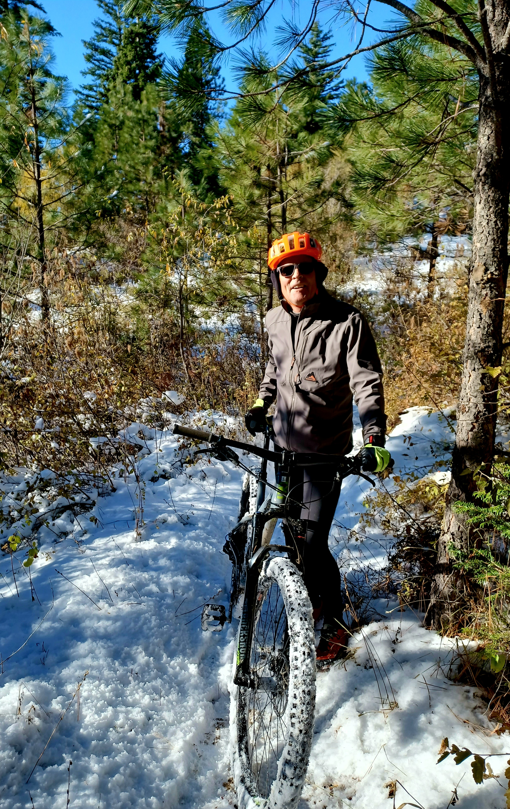

Hi Skiers, 

The snow is here and grooming is coming soon!
We may have grooming at the Hyak, Crystal Springs and/or Cabin Creek Sno Parks as soon as December 1st.  

If you are interested in a tuneup Skate or Classic ski lesson,  multiple one hour lessons; and having private or two person lessons,  boogie over to my Website Schreckski.com 
to get your favorite day and time.  The La Nina forecast looks promising for an early snow season with colder and wetter conditions this winter. I also really appreciate your referring me to your friends and family who are interested in learning to XC ski more efficiently and live our winters!

My cross country skiing daughter asked me earlier what I do to prepare for the XC ski season and any exercises that she could do at her gym.  I thought I would share with you jic you are interested in this!

Hi Annie,

Besides, biking or ski bounding every day, I do a ski workout in my living room every other day. I don't have a gym in the winter so I do these in my cabin: 
1. A ski erg machine is ideal but several thousand dollars and is what you want to recreate for the most important exercise that mimics XC Skiing: Since you have a gym, all you need is one or two Bosu Balls and rubber cords with two handles. You can use the pull down weight machine but straps work just as well because you don't need heavy tension.
Basically in all the workouts, feel and be skating or double poling. (doing Classic techniques is a little harder but can be added.) Basically just skate, then double pole, then Classic (4 5 min. sessions  of each) with proper arm swing from one Bosu to the other. 

If no Bosu, then it still can be done. The Bosu ball (or any unstable surface) adds the snow feeling and improves your balance.  Do it for several sets at a pretty high cadence level thinking about dorsiflection: shin close to top of foot just before push off. Rounded back at similar forward angle as your shin. 

Also think about Hips forward, feel like you're engaging your Glutes. They are your strongest muscles that often are not engaged (Lazy Glutes!)  Feel like you are squeezing a roll of quarters in your butt crack as you utilize all of your leg muscles in each leg.  
Remember, Good high hands, elbows outside hands, for push off.  Basically you are skiing, using the same muscles and practicing good form. It has worked for me for the last 10 seasons and I seem to not lose much efficiency in my ski techniques on the first days on snow.

2. Squats.  A variety of ways to mimic squats without weights. First, to use the "chair sit against the wall", modify by practicing good dorsiflection of your shins. Make it dynamic by sliding up and down the wall. Pretend you are downhill skiing. 

If you have weights, try dead lifts. Weight bar on your shoulders, pull-ups with a bent over back using lighter weights of course, etc. Always think like you're using all your leg muscles, Quads, Glutes and Hamstrings. All can be done with any heavy object you have in your home if you don't have weights. Try squatting down to a low stool and up. If too easy squat one leg at a time!

Next, work on a Strong core! 
3. All of the usual core exercises: my favorite as you know are planks on an unstable surface.  They are really good for skiing! Think of your core as all muscles and stabilizers between your pelvic floor (inside your hips) and your diaphragm. It's a box 📦 where all of your ski muscles attach to. A strong core enables your muscles to work more efficiently!

4. Bar exercises,  pull-ups with hands at all the different positions.  If you're too tired, add help by using support from one leg. Hang from the bar and pull up your legs. 

5. Work on dynamic balance.  Sure standing on one leg is OK;  but imitating skiing from one leg and then the other with arm swing and good form is going to be much better to mimic skiing on snow. The Bosu ball is your friend! I leave mine in the narrow hallway between my living room and the bathroom.  I jump on it every time I go by it and when I brush my teeth. I do longer sessions every other day.  Just don't trip on it in the dark! 

Working these areas every other day can make a huge difference in just 6 weeks. You can do it all in 45 minutes or get real fast between transitions and get it down to about 25 if you're interested. 

let's bike if we can't ski!

Schreck

"Still round the corner there may wait,
a new road or a secret gate."

